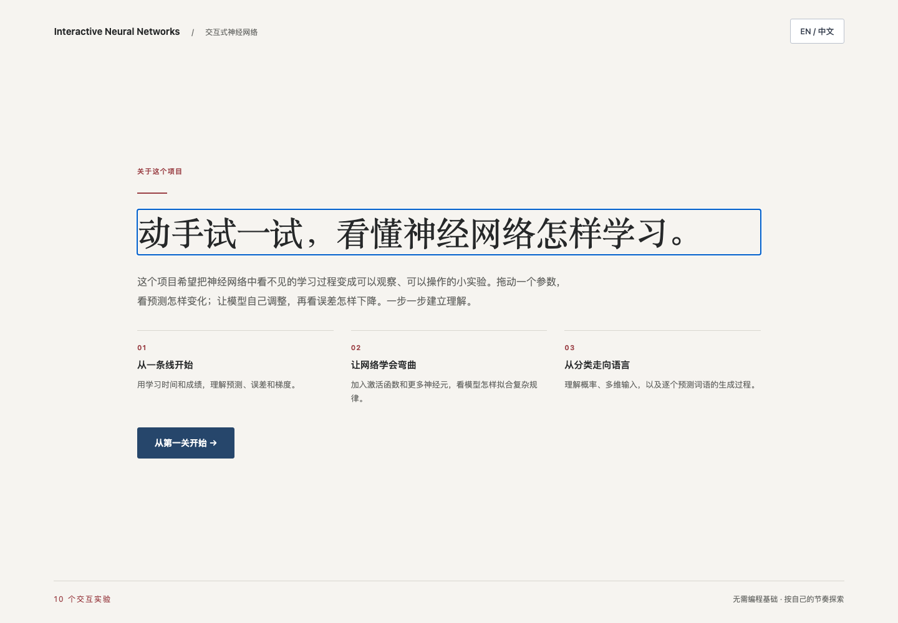
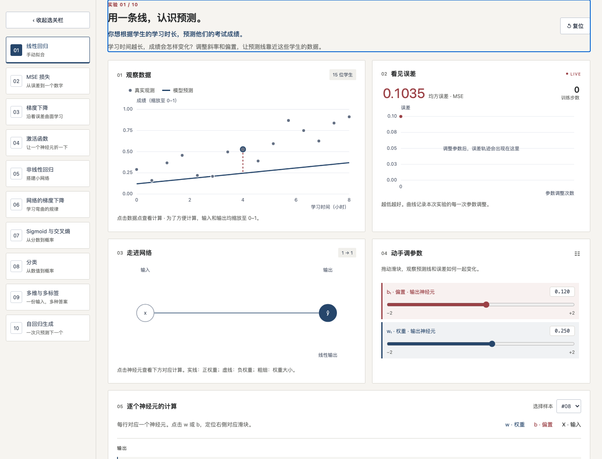

# Interactive Neural Networks

A bilingual, interactive guide to neural networks. Learn by changing parameters, watching predictions move, and seeing how loss and training respond in real time.

**[Try the hosted version →](https://swangarch.github.io/interactive-neural-networks/)**

English and Chinese are both available from the language switcher.



## How to use it

1. Open the [live website](https://swangarch.github.io/interactive-neural-networks/).
2. Choose a lesson from the left sidebar.
3. Drag weights, biases, and other controls to see predictions and loss update immediately.
4. Click data points or neurons to inspect their calculations.
5. Use **one training step** or **auto train** to watch the model learn, and **reset** whenever you want to start again.

There is no required order after the first lesson, so you can move freely between experiments.



## What you can explore

The site contains ten small experiments:

- **Foundations:** linear regression, mean squared error, gradient descent, and activation functions.
- **Neural networks:** nonlinear regression and training a network on more complex patterns.
- **Classification:** sigmoid, cross-entropy, binary classification, multiple inputs, multiclass outputs, and multilabel outputs.
- **Generation:** autoregressive text generation, one token at a time.

Each lesson starts with a practical question and lets you explore the idea directly through charts, controls, network diagrams, and live equations.

## Run locally

Download or clone the repository, then open `index.html` in a browser. The lessons work offline and do not send your data anywhere.

If your browser restricts local files, start a small local server instead:

```sh
npm start
```

Then visit [http://127.0.0.1:4173](http://127.0.0.1:4173).
